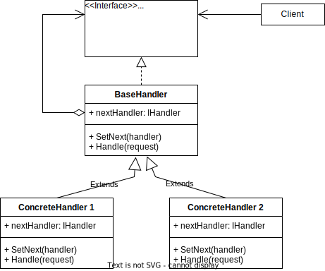

# Chain of responsibility Pattern

Definition: Chain of Responsibility is a behavioral design pattern that lets you pass requests along a chain of handlers. 
Upon receiving a request, each handler decides either to process the request or to pass it to the next handler in the chain.

## Participants

- Handler: Handles the request, or delegates it to another handler, to which it keeps the reference in itself

## Sources

- https://refactoring.guru/design-patterns/chain-of-responsibility
- https://www.tutorialspoint.com/design_pattern/chain_of_responsibility_pattern.htm
