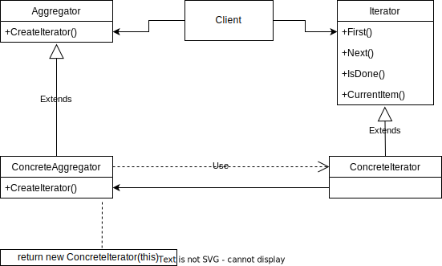

# Iterator Pattern

GoF Definition: Provide a way to access the elements of an aggrefate object sequentially without exposing its underlying representation.

## Elements of the State Pattern

- Aggregate: Defines an interface for creating an Iterator object.
- Concrete Aggregate: Implements the Iterator creation interface to return an instance of the proper Concrete Iterator.
- Iterator: Defines an interface for accessing and traversing elements.
- Concrete Iterator: Implements the Iterator interface. Keeps track of the current position.

## Approach

## Sources

- https://www.dofactory.com/net/iterator-design-pattern
