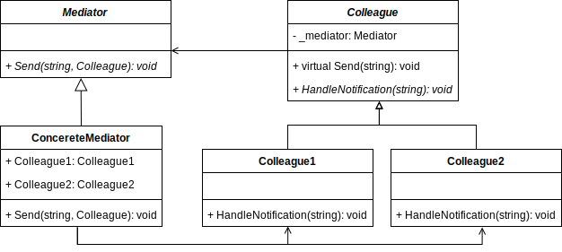

# Mediator Pattern

GoF Definition:  Define an object that encapsulates how a set of objects interact. 
Mediator promotes loose coupling by keeping objects from referring to each other explicitly, and it lets you vary their interaction independently.

Simple explanation: Helps you eliminate mutual dependencies between various classes. Restricts direct communications between the classes and forces them to collaborate only via the mediator.

## Participants

- Mediator: Defines an interface for communicationg with components
- ConcreteMediator: Encapsulate relations between various components. 
- Components: Various classes that contain some business logic. Each component has a reference to a mediator, declared with the type of the mediator interface.
