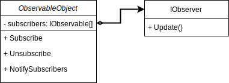

# Observable Pattern

GoF Definition: Define a one-to-many dependency between objects so that when one object changes state, all its dependents are notified and updated automatically.

## Elements of the Observable Pattern
- Observable (Subject): Contains a list of observers to notify of any change in it’s state, so it should provide methods using which observers can register and unregister themselves. Also contain a method to notify all the observers of any change and either it can send the update while notifying the observer or it can provide another method to get the update. Observer should have a method to set the object to watch and another method that will be used by Subject to notify them of any updates.
- Observer: The subscriber. It's listen to the changes in the subject.

## Versions

- V1 - Simple implementation.
- V2 - Thread safe implementation.
- V3 - EventHandler: .NET specific implementation.
- V4 - ReactiveExtension.

## Sources

- https://refactoring.guru/design-patterns/observer
