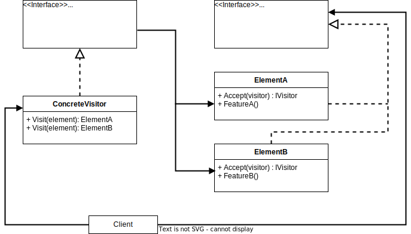

# Visitor Pattern

Definition: Visitor is a behavioral pattern, that grants the opportunity to separate algorithms from the objects on which they operate. 
As per the pattern, the element object has to accept the visitor object, so that visitor object handles the operation on the element object.

## Participants

- Visitor: Contains the behavior that the original object would have executed.
- Element: The object, that has to accept the visitor, and through it can handle the operation.

## Sources

- https://refactoring.guru/design-patterns/visitor
- https://www.tutorialspoint.com/design_pattern/visitor_pattern.htm
