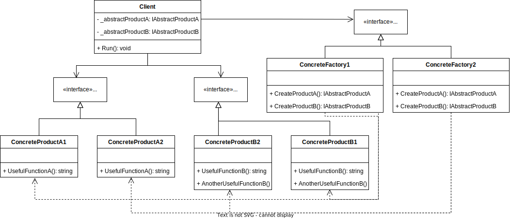

# Abstract Factory Pattern

GoF Definition: The Abstract Factory Design Pattern provides a way to encapsulate a group of individual factories that have a common theme without specifying their concrete classes.

In other words: A super factory that creates other factories, Factory of Factories.

## Participants
- AbstractFactory: declares an interface for operations that create abstract products
- ConcreteFactory: implements the operations to create concrete product objects
- AbstractProduct: declares an interface for a type of product object
- Product: defines a product object to be created by the corresponding concrete factory. Implements the AbstractProduct interface
- Client: uses interfaces declared by AbstractFactory and AbstractProduct classes

## Sources
- [Dofactory - C# Abstract Factory](https://www.dofactory.com/net/abstract-factory-design-pattern)
- [Refactoring.guru - Abstract Factory](https://refactoring.guru/design-patterns/abstract-factory)
- [Pluralsight - C# Design Patterns: Factory and Abstract Factory](https://app.pluralsight.com/library/courses/c-sharp-design-patterns-factory-abstract/table-of-contents)
