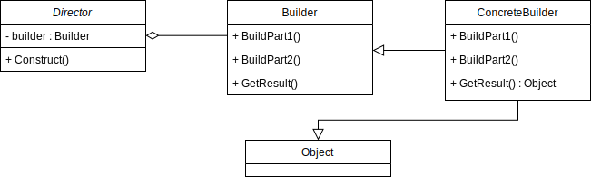

# Builder Pattern

GoF Definition: The builder pattern is a design pattern that allows for the step-by-step creation of complex objects using the correct sequence of actions.
The construction is controlled by a director object that only needs to know the type of object it is to create.

## Elements of the Builder Pattern
- Director: The director-class controls the algorithm that generates the final product object.
- Builder: This interface defines all of the steps that must be taken in order to correctly create a product. The actual functionality of the builder is carried out in the concrete implementations.
- ConcreteBuilder: There may be any number of concrete builder classes inheriting from Builder. These classes contain the functionality to create a particular complex product.
- Product: The product class defines the type of the complex object that is to be generated by the builder pattern.

## Versions

- Simple implementation (Non-immutable).
- Simple implementation (Immutable)
- Using AbstractBuilder nuget package (tests for usage).
- Buildenator nuget package (tests for usage).

## Sources

- https://howtodoinjava.com/design-patterns/creational/builder-pattern-in-java/#1-the-gof-builder-pattern
- https://www.geeksforgeeks.org/builder-design-pattern/
- https://refactoring.guru/design-patterns/builder
- https://github.com/progala2/Buildenator
- https://stakhov.pro/code-generation-with-net-5-builder-pattern/
