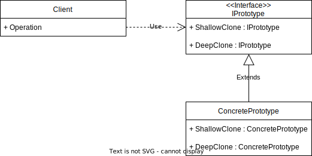

# Singleton Pattern



GoF Definition: Specifies the kinds of objects to create using a prototypical instane and creates new objects by copying this prototype.

## Benchmark

``` ini

BenchmarkDotNet=v0.13.1, OS=Windows 10.0.22000
11th Gen Intel Core i7-11800H 2.30GHz, 1 CPU, 16 logical and 8 physical cores
.NET SDK=6.0.101
  [Host]     : .NET 6.0.1 (6.0.121.56705), X64 RyuJIT  [AttachedDebugger]
  DefaultJob : .NET 6.0.1 (6.0.121.56705), X64 RyuJIT


```
|                      Method |      Mean |     Error |    StdDev | Ratio | RatioSD |  Gen 0 | Code Size | Allocated |
|---------------------------- |----------:|----------:|----------:|------:|--------:|-------:|----------:|----------:|
|           NaiveShallowClone |  7.633 ns | 0.1284 ns | 0.1201 ns |  1.00 |    0.00 | 0.0057 |     112 B |      72 B |
| MemberwiseCloneShallowClone | 23.359 ns | 0.4001 ns | 0.3742 ns |  3.06 |    0.06 | 0.0032 |     141 B |      40 B |
|                             |           |           |           |       |         |        |           |           |
|              NaiveDeepClone | 11.458 ns | 0.2779 ns | 0.2729 ns |  1.00 |    0.00 | 0.0083 |     123 B |     104 B |
|    MemberwiseCloneDeepClone | 46.511 ns | 0.8908 ns | 0.8332 ns |  4.06 |    0.15 | 0.0057 |      69 B |      72 B |
