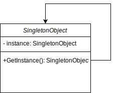

# Singleton Pattern

GoF Definition: Ensures a class has only one instance, and provides a global point of access to it.

## Sources

- https://github.com/ardalis/DesignPatternsInCSharp
- https://csharpindepth.com/articles/singleton
