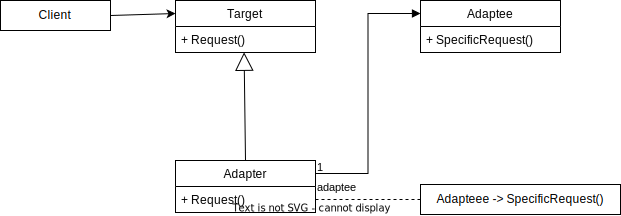

# Adapter Pattern

GoF Definition: Converts the interface of a class into another interface that clients expect. Let's classes work together that couldn't otherwise because of incompatible interfaces.

## Elements of the Adapter Pattern

- Target: Defines the domain-specific interface used by the client code.
- Adaptee: It has a useful behavior, but it's interface is incompatible with the client code.
- Adapter: It makes the adaptee's interface compatible with the target's interface.

## Sources

- https://refactoring.guru/design-patterns/adapter/csharp/example
