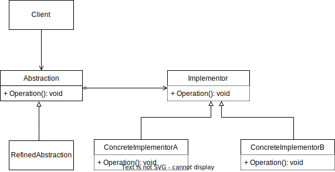

# Bridge Pattern

GoF Definition: Its purpose is to decouple an abstraction from its implementation so that the two can vary independently.

In other worlds: Its purpose is to split a class hierarchy through composition to reduce coupling.

## Sources

- [C# Design Patterns: Bridge By Vladimir Khorikov](https://app.pluralsight.com/library/courses/design-patterns-c-sharp-bridge/table-of-contents)
