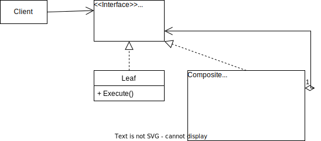

# Composite Pattern

GoF Definition: Composes objects into tree structures to represent part-whole hierarchies.
Lets clients treat individual objects and compositions of objects uniformly.

## Participants

- Component: Describes operations that are common to both Leaf and Composite elements of the tree.
- Leaf: Basic element of the tree that doesn't have child nodes.
- Composite: The container that has sub-elements (other containers or leaves). 

## Sources
- [Dofactory - C# Composite](https://www.dofactory.com/net/composite-design-pattern)
- [Refactoring.guru - Composite](https://refactoring.guru/design-patterns/composite)
- [CodeMaze - C# Design Patterns – Composite](https://code-maze.com/composite/)
