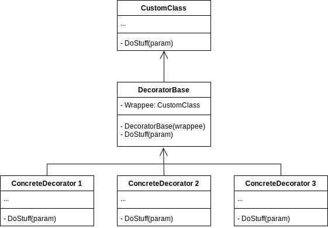

# Decorator Pattern

Definition: Decorator is a structural design pattern that lets you attach new behaviors to objects by placing these objects inside special wrapper objects that contain the behaviors.
 Used when we need to create a large number of similar objects, one importatnt feature of its objects is that they are immutable.
 Also known as wrapper.

## Elements of the Decorator Pattern
- A common interface, that both the wrapper and the wrapped object implements
- A concrete component is the object being wrapped.
- Base decorator, which hase a reference to the wrapped object. This reference should be declared as the common interface. This component delegates all operations to the wrapped object.
- Concrete decorators, which can define extra behaviours, overrides the base decorator's methods, and execute their behaviour before or after calling the parent method.

## Versions
- Naive implementation.

## Sources

- https://refactoring.guru/design-patterns/decorator
