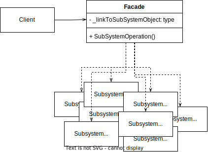

# Facade Pattern

GoF Definition:  Provide a simplified interface to a library, a framework, or any other complex set of classes.

In other words: Provides a simple, easy to understan interface over a large and body of code.

## Sources
- [Dofactory - C# Facade](https://www.dofactory.com/net/facade-design-pattern)
- [Pluralsight - C# Design Patterns:Facade](https://app.pluralsight.com/library/courses/csharp-design-patterns-facade/table-of-contents)
