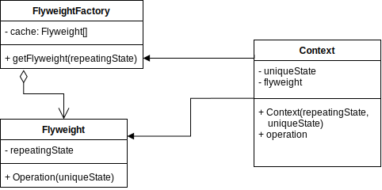

# Flyweight Pattern

Definition: Flyweight is a structural design pattern that provides ways to decrease object count thus improving application required objects structure.
 Used when we need to create a large number of similar objects, one importatnt feature of its objects is that they are immutable. Also known as cache.

## Elements of the Builder Pattern
- Unique (Extrinsic) State: Volatile parts of the object’s state, often altered “from the outside” by other objects, is called the extrinsic state.
- Repeating (Intrinsic) State: Constant data of an object, that is usually called the intrinsic state. It lives within the object; other objects can only read it, not change it.
- Factory (With cache): Creates or returns the repeating states of unique objects.

## Versions

- Naive implementation.

## Sources

- https://refactoring.guru/design-patterns/flyweight
- https://www.tutorialspoint.com/design_pattern/flyweight_pattern.htm
- https://www.geeksforgeeks.org/flyweight-design-pattern/
