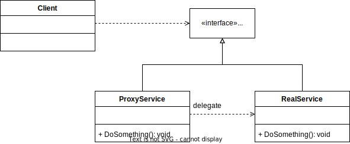

# Proxy Pattern



GoF Definition: Proxy is a structural design pattern that lets you provide a substitute or placeholder for another object. A proxy controls access to the original object, allowing you to perform something either before or after the request gets through to the original object.

## Participants
- Service Interface: Declares the interface of the service. The proxy must follow this interface to be able to disguise itself as a service object.
- Service: A class that provides some useful logic.
- Proxy: Has a reference field that point to a service object. After the proxy finishes its processing, it passes the request to the service object.
- Client: Works wit both services and proxies via the same interface. This way you can pass a proxy into any code that expects a service object.

## Vartiants
- Conceptual: Perform additional actions when a resource is accessed.
- Dynamic: Generic implementation.

## Benchmarks
``` ini

BenchmarkDotNet=v0.13.1, OS=Windows 10.0.19044.1526 (21H2)
Intel Core i7-10700 CPU 2.90GHz, 1 CPU, 16 logical and 8 physical cores
.NET SDK=6.0.200
  [Host]     : .NET 6.0.2 (6.0.222.6406), X64 RyuJIT  [AttachedDebugger]
  DefaultJob : .NET 6.0.2 (6.0.222.6406), X64 RyuJIT


```
|          Method |       Mean |     Error |    StdDev |     Median |  Ratio | RatioSD | Code Size |  Gen 0 | Allocated |
|---------------- |-----------:|----------:|----------:|-----------:|-------:|--------:|----------:|-------:|----------:|
|     BankAccount |   1.116 ns | 0.0022 ns | 0.0020 ns |   1.116 ns |   1.00 |    0.00 |      39 B |      - |         - |
| ConceptualProxy |  79.485 ns | 1.1645 ns | 2.3256 ns |  78.573 ns |  72.19 |    2.85 |      39 B | 0.0086 |      72 B |
|    DynamicProxy | 273.049 ns | 1.0390 ns | 0.9719 ns | 273.097 ns | 244.68 |    1.07 |      48 B | 0.0277 |     232 B |

## Sources
- [Dofactory - C# Proxy](https://www.dofactory.com/net/proxy-design-pattern)
- [Refactoring.guru - Proxy](https://refactoring.guru/design-patterns/proxy)
- [Pluralsight - C# Design Patterns: Proxy](https://app.pluralsight.com/library/courses/c-sharp-design-patterns-proxy/table-of-contents)
- [Making a Dynamic Proxy in C# with ImpromptuInterface](https://www.youtube.com/watch?v=1rjQC6ftC4k)
