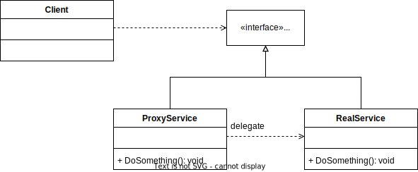

# Proxy Pattern

GoF Definition: Proxy is a structural design pattern that lets you provide a substitute or placeholder for another object. A proxy controls access to the original object, allowing you to perform something either before or after the request gets through to the original object.

## Participants
- Service Interface: Declares the interface of the service. The proxy must follow this interface to be able to disguise itself as a service object.
- Service: A class that provides some useful logic.
- Proxy: Has a reference field that point to a service object. After the proxy finishes its processing, it passes the request to the service object.
- Client: Works wit both services and proxies via the same interface. This way you can pass a proxy into any code that expects a service object.

## Vartiants
- Smart Proxy: Perform additional actions when a resource is accessed.

## Sources
- [Dofactory - C# Proxy](https://www.dofactory.com/net/proxy-design-pattern)
- [Refactoring.guru - Proxy](https://refactoring.guru/design-patterns/proxy)
- [Pluralsight - C# Design Patterns: Proxy](https://app.pluralsight.com/library/courses/c-sharp-design-patterns-proxy/table-of-contents)
- [Making a Dynamic Proxy in C# with ImpromptuInterface](https://www.youtube.com/watch?v=1rjQC6ftC4k)
